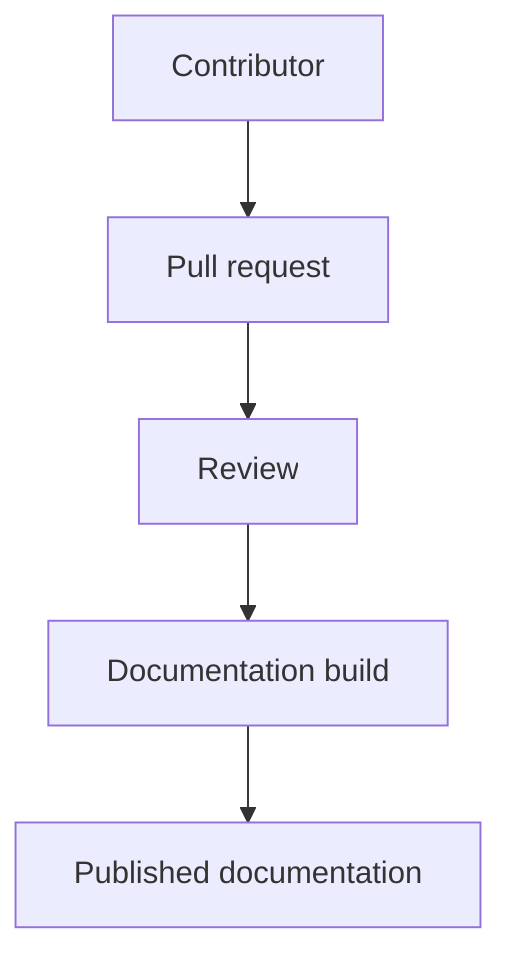
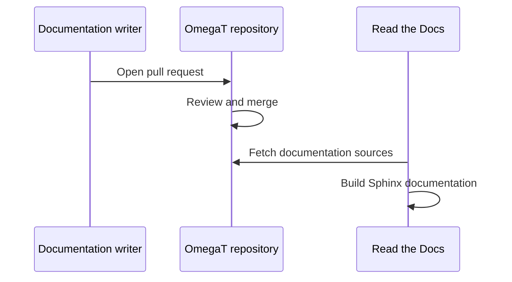
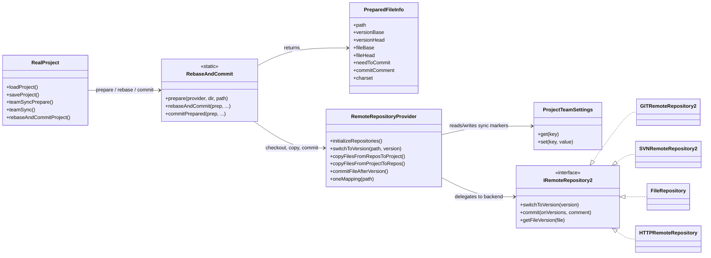

# Developer documentation

Developer documentation explains how OmegaT is designed, built, tested, extended,
released, and maintained. It is intended for contributors who work on OmegaT
itself, plugin authors, release maintainers, documentation writers, and people
reviewing technical decisions.

The source files are stored in `src/docs/developer`.

## Directory structure

The developer documentation directory contains Markdown source files and several
supporting directories.
```
text
src/docs/developer/
├── adr/
├── assets/
├── changes/
├── scripts/
├── stylesheets/
├── conf.py
├── index.md
└── *.md
```
### `adr`

The `adr` directory contains Architecture Decision Records.

Use ADRs to explain important technical or project-level decisions. An ADR should
record why a decision was made, not only what was changed.

Good ADR topics include:

- choosing or replacing a framework, tool, or library
- changing an architectural boundary
- adopting a new development or release process
- making a compatibility or security-related decision
- documenting a trade-off that future contributors may question

An ADR should usually include:

- context
- decision
- alternatives considered
- consequences
- related issues, pull requests, or discussions when useful

The ADR index is linked from the main developer documentation index.

### `assets`

The `assets` directory contains static files used by the generated developer
documentation.

Typical files include:

- SVG diagrams
- images used by Markdown pages
- icons or small visual assets
- static files copied into the Sphinx HTML output

Use `assets` for files that are directly referenced by documentation pages or
needed by the HTML theme configuration.

Example Markdown image reference:
```
markdown

```
Prefer descriptive file names and meaningful alternative text.

### `changes`

The `changes` directory contains change notes and contributor-facing change
documentation.

Use this directory for technical change descriptions that are useful beyond a
single pull request. These notes can help contributors understand what changed,
why it changed, and what follow-up work may be needed.

Good change note topics include:

- important behavior changes
- migration notes
- compatibility notes
- notable internal restructuring
- documentation of project-wide technical changes

The changelog index is linked from the main developer documentation index.

### `scripts`

The `scripts` directory under `src/docs/developer` contains documentation and
explanations for OmegaT sample scripts.

It does not contain the sample scripts themselves. The actual sample scripts are
stored in the project root `scripts/` directory.
The project root `scripts/` contents are installed with OmegaT when OmegaT is
installed, so they are part of the user-facing scripting examples distributed
with the application.

Use `src/docs/developer/scripts/` for supporting documentation such as:

- explanations of the sample scripts in the project root `scripts/` directory
- notes about how the sample scripts demonstrate OmegaT scripting APIs
- maintenance notes for contributors who update sample scripts
- additional manual material related to [How to write an OmegaT script](51.HowToWriteScript.md)

When documenting sample scripts:

- refer to the actual script location as `scripts/`
- keep explanations synchronized with the installed sample scripts
- describe what each sample script demonstrates
- mention any required OmegaT version, plugin, or external dependency
- avoid duplicating full script contents unless the explanation requires it

If you need helper scripts for building, checking, or generating developer
documentation, do not place them in `src/docs/developer/scripts/`. Use another
clearly named location and document its purpose separately.

### `stylesheets`

The `stylesheets` directory contains custom CSS used by the developer
documentation.

Use this directory for styling that cannot be handled by the selected Sphinx
theme or standard MyST/Sphinx options.

Custom styles should be limited and maintainable. Before adding CSS, consider
whether the same result can be achieved with:

- normal Markdown structure
- MyST directives
- Sphinx theme options
- existing theme classes

When adding styles:

- keep selectors specific enough to avoid accidental global changes
- prefer accessibility-friendly colors and spacing
- test both light and dark theme modes when applicable
- avoid styling that makes generated pages hard to read or print

## Main files

### `index.md`

`index.md` is the entry point for the developer documentation.

Add new pages to this file so readers can find them from the table of contents.
Place each link in the section where readers are most likely to look for it.

### `conf.py`

`conf.py` is the Sphinx configuration file for the developer documentation.

It defines the Sphinx extensions, MyST Markdown settings, HTML theme, static
asset configuration, Mermaid support, and other documentation build options.

### Markdown source files

Most developer documentation pages are Markdown files in `src/docs/developer`.

Use the existing numeric file naming style for top-level pages, for example:
```
text
48.DeveloperDocumentation.md
```
When adding a large new topic, create a separate file instead of making an
existing page too long.

After creating a new page, add it to `index.md` so it appears in the developer
documentation table of contents.

## Sphinx documentation system

Developer documentation is built with Sphinx.

The Sphinx configuration file is:
```text
src/docs/developer/conf.py
```
The configuration defines the project metadata, enabled Sphinx extensions, MyST
Markdown support, HTML theme settings, static asset paths, and other build
options.

The developer documentation uses Markdown with MyST extensions. This allows
contributors to write normal Markdown while still using Sphinx features when
needed.

Common Markdown syntax is preferred unless a Sphinx or MyST feature is required.

## Read the Docs

Read the Docs builds the developer documentation using the repository-level
configuration file:
```text
.readthedocs.yaml
```
The Read the Docs configuration points to the Sphinx configuration under
`src/docs/developer/conf.py` and installs Python dependencies from:
```text
src/docs/requirements.txt
```
When adding a Sphinx extension or documentation build dependency, update
`src/docs/requirements.txt` and check that the documentation still builds
locally before opening a pull request.

## Diagrams

Diagrams help explain architecture, workflows, and data flow. The developer
documentation supports both static SVG images and Mermaid diagrams.

Use the format that best fits the contribution:

- Use SVG for polished infographics, screenshots, and diagrams prepared with
  drawing tools.
- Use Mermaid for diagrams that are easier to maintain as text in version
  control.

### Embedding SVG images

Place SVG files in an appropriate documentation asset directory, for example:
```text
src/docs/developer/assets/
```
Then reference the SVG from Markdown:
```markdown

```

Use meaningful file names and descriptive alternative text. Alternative text is
important for accessibility and for readers using non-visual tools.
When you want to introduce bullet lists as diagram, please use a plain Markdown text for it.

### Mermaid diagrams

Mermaid diagrams can be written directly in Markdown fenced code blocks.

Example flowchart:
````markdown

````

Rendered result:


Example sequence diagram:
````markdown

````

Rendered result:


Example sequence diagram:
````markdown

```
Rendered result:

```
```
mermaid
sequenceDiagram
    participant Writer as Documentation writer
    participant Repo as OmegaT repository
    participant RTD as Read the Docs

    Writer->>Repo: Open pull request
    Repo->>Repo: Review and merge
    RTD->>Repo: Fetch documentation sources
    RTD->>RTD: Build Sphinx documentation
```
Example class and call-path diagram:

Use this style when explaining relationships between classes and the main call
paths between them. It is useful for architecture notes because the diagram stays
reviewable as text.
```
`markdown

````

Rendered result:


For larger architecture diagrams, prefer Mermaid when the diagram is mainly
classes, responsibilities, and call paths. Prefer SVG when the diagram needs
precise layout, branding, or infographic-style presentation for human reading.

## Writing guidelines

When writing developer documentation:

- Prefer clear explanations over implementation trivia.
- Link to related pages instead of duplicating long content.
- Keep examples small and maintainable.
- Include diagrams when they make relationships or workflows easier to
  understand.
- Keep filenames, headings, and link text descriptive.
- Update `index.md` when adding a new document.
- Check local documentation builds when changing Sphinx configuration,
  dependencies, diagrams, or cross-document links.
