# ADR: Comprehensive Static Code Analysis Strategy

## Status

Accepted - Implemented across multiple PRs and ongoing enhancements

## Context

OmegaT is a mature Java project with over 16 years of development history and contributions from multiple developers.
As the codebase has grown, several challenges have emerged that necessitate a comprehensive static code analysis approach:

### Historical Context and Pain Points

- **Legacy bug discovery**: A recent production NPE was traced back to 16-year-old code that lacked proper null checking, exposed only when new features interacted with legacy components
- **Code quality inconsistency**: Multiple contributors across different time periods have resulted in varying code styles and quality patterns
- **Manual review limitations**: Human code reviewers cannot consistently catch all potential issues, especially subtle bugs in large codebases
- **Maintenance burden**: Technical debt accumulation makes it increasingly difficult to maintain and extend the codebase safely
- **Modern development practices**: Industry trends toward stronger static analysis, nullity annotations, and automated quality gates

### Current State Analysis

The project previously relied on:
- Manual code reviews
- Limited static analysis tooling
- Runtime testing to catch issues
- Ad-hoc quality checks

This approach proved insufficient for preventing production issues and maintaining consistent code quality at scale.

## Decision

We will implement a comprehensive static code analysis strategy using multiple complementary tools integrated into our build pipeline and CI/CD process.

### Tool Selection and Responsibilities

#### 1. SpotBugs
- **Purpose**: Bug detection and security vulnerability identification
- **Focus**: Runtime behavior analysis, potential bugs, security issues
- **Integration**: Existing tool, enhanced configuration and rule tuning
- **Scope**: All Java source code

#### 2. PMD (PR #1391)
- **Purpose**: Code quality, maintainability, and performance analysis
- **Focus**: Code smells, design issues, unused code, unnecessary object creation
- **Rules**: Minimal, non-intrusive ruleset focusing on clear violations
- **Integration**: Gradle tasks (`pmdMain`, `pmdTest`) and CI/CD pipeline

#### 3. Checkstyle
- **Purpose**: Code formatting and style consistency
- **Focus**: Coding standards enforcement, formatting consistency
- **Integration**: Existing tool, maintained configuration
- **Scope**: Style and formatting rules

#### 4. Error Prone (PR #1496)
- **Purpose**: Compile-time bug detection and Java best practices
- **Focus**: Common Java mistakes, null pointer prevention, API misuse
- **Special feature**: NullAway plugin for enhanced null safety
- **Integration**: Gradle build system with Java 17 support

### Implementation Architecture

```mermaid
graph TB
    subgraph Engine["🔧 Execution platforms"]
        Dev["🛠️ Developer<br/>Environment"]
        Build["⚙️ Build System<br/>(Gradle)"]
        CI["🔄 CI/CD Pipeline<br/>(GitHub/Azure)"]
    end
    
    subgraph Analysis["📊 Static Analysis Layer"]
        SpotBugs["🐛 SpotBugs<br/>━━━━━━━━━<br/>• Bug detection<br/>• Security issues<br/>• Pattern matching"]
        PMD["📈 PMD<br/>━━━━━━━━━<br/>• Code smells<br/>• Unused code<br/>• Performance issues"]
        Checkstyle["📏 Checkstyle<br/>━━━━━━━━━<br/>• Coding style<br/>• Format checking<br/>• Standards compliance"]
        ErrorProne["⚠️ Error Prone<br/>━━━━━━━━━<br/>• Compile-time bugs<br/>• NPE prevention<br/>• Best practices"]
    end
    
    Dev --> Analysis
    Build --> Analysis
    CI --> Analysis
    
    classDef inputBox fill:#e3f2fd,stroke:#1976d2,stroke-width:2px,color:#000
    classDef analysisBox fill:#e8f5e8,stroke:#388e3c,stroke-width:2px,color:#000
    
    class Dev,Build,CI inputBox
    class SpotBugs,PMD,Checkstyle,ErrorProne analysisBox
```

### Build Integration

- **Local development**: All tools run via `./gradlew check`
- **CI/CD integration**: Automated execution on pull requests
- **IDE integration**: Support for running individual tools from development environments
- **Gradle tasks**:
    - `spotbugsMain` / `spotbugsTest`
    - `pmdMain` / `pmdTest`
    - `checkstyleMain` / `checkstyleTest`
    - Error Prone runs automatically during compilation

## Consequences

### Positive Outcomes

#### Code Quality Improvements
- **Early bug detection**: Issues caught at compile-time and build-time rather than runtime
- **Consistent standards**: Automated enforcement of coding standards across all contributors
- **Technical debt reduction**: Systematic identification and resolution of code quality issues
- **Security enhancement**: Automated detection of potential security vulnerabilities

#### Development Process Benefits
- **Faster feedback loops**: Immediate feedback during local development
- **Reduced review burden**: Automated checks handle routine quality issues
- **Knowledge transfer**: Tools educate developers about Java best practices
- **Confidence in changes**: Higher assurance when modifying legacy code

#### Project Maintenance
- **Preventive approach**: Proactive issue prevention rather than reactive bug fixing
- **Scalable quality**: Quality enforcement that scales with team size and codebase growth
- **Documentation**: Tool outputs serve as quality metrics and improvement tracking

### Negative Consequences

#### Initial Implementation Costs
- **Setup complexity**: Multiple tool configurations and CI/CD pipeline updates
- **Learning curve**: Developers need to understand tool outputs and resolution strategies
- **Build time impact**: Additional processing time during compilation and builds
- **False positive management**: Occasional need to suppress or configure rules for legitimate patterns

#### Ongoing Maintenance
- **Tool updates**: Regular updates to tool versions and rule configurations
- **Rule tuning**: Ongoing adjustment of rules based on team feedback and project needs
- **Suppression management**: Maintaining justified suppressions and reviewing their continued validity

### Risk Mitigation Strategies

- **Gradual rollout**: Implementing tools incrementally with minimal, focused rulesets
- **Team feedback loops**: Regular review and adjustment of rules based on developer experience
- **Documentation**: Clear guidelines for understanding and resolving tool findings
- **Flexibility**: Ability to suppress rules when justified with proper documentation

## Complementary Initiatives

### Nullity Annotations Enhancement
- **Motivation**: Modern development practices and Kotlin interoperability
- **Approach**: Increased usage of `@Nullable` and `@NonNull` annotations
- **Benefit**: Enhanced static analysis capabilities, especially with Error Prone's NullAway
- **Industry trend**: Growing adoption in Java ecosystem and mobile development

### Technical Debt Management
- **Systematic approach**: Using static analysis findings to prioritize technical debt
- **Metrics tracking**: Monitoring code quality trends over time
- **Refactoring guidance**: Tool outputs inform refactoring priorities

## Implementation Timeline

1. **Phase 1** (Completed): SpotBugs baseline
2. **Phase 2** ([PR #770](https://github.com/omegat-org/omegat/pull/770), [PR #1296](https://github.com/omegat-org/omegat/pull/1296)): Checkstyle enforcement as CI default
3. **Phase 3** ([PR #1391](https://github.com/omegat-org/omegat/pull/1391)): PMD integration with minimal ruleset
4. **Phase 4** ([PR #1496](https://github.com/omegat-org/omegat/pull/1496)): Error Prone with NullAway plugin
5. **Phase 5** (Ongoing): Nullity annotation enhancement and rule refinement

## Alternatives Considered

### Single Tool Approach
- **Option**: Rely on one comprehensive tool (e.g., SonarQube)
- **Rejected**: No single tool covers all aspects effectively; multiple specialized tools provide better coverage

### Manual Process Only
- **Option**: Continue with manual code reviews and minimal tooling
- **Rejected**: Proven insufficient by production issues and scalability concerns

### Different Tool Combinations
- **Considered**: Various combinations of static analysis tools
- **Decision rationale**: Selected tools based on Java ecosystem adoption, complementary capabilities, and integration ease

## Success Metrics

- **Bug reduction**: Decrease in production issues, especially NPEs and common Java mistakes
- **Code quality trends**: Improvement in static analysis metrics over time
- **Developer satisfaction**: Positive feedback on tool helpfulness vs. friction
- **Review efficiency**: Reduction in time spent on code review for routine quality issues
- **Maintenance velocity**: Improved confidence and speed when working with legacy code

## Notes

This comprehensive static analysis strategy represents a significant architectural decision to prioritize code quality and maintainability. The multi-tool approach provides defense in depth against different categories of issues while maintaining developer productivity.

The strategy acknowledges that static analysis is not a silver bullet but rather a foundational capability that, combined with good development practices and thorough testing, significantly improves software quality and maintainability.

Regular review and adjustment of this strategy will ensure it continues to serve the project's evolving needs while adapting to new tools and industry practices.

## References

- [PR #770: CI: enforce checkstyle as default](https://github.com/omegat-org/omegat/pull/770)
- [PR #1296: Checkstyle integration](https://github.com/omegat-org/omegat/pull/1296)
- [PR #1391: chore: Add PMD static code analysis with minimum rulesets](https://github.com/omegat-org/omegat/pull/1391)
- [PR #1496: chore(build): introduce error-prone system](https://github.com/omegat-org/omegat/pull/1496)